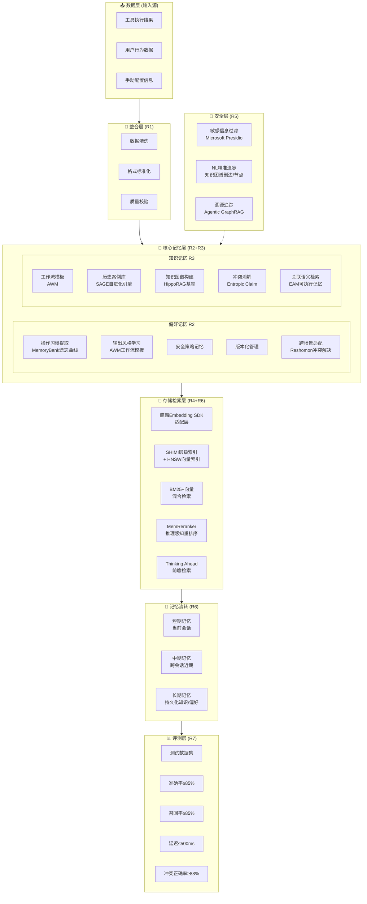
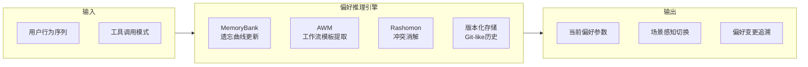
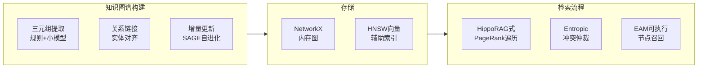
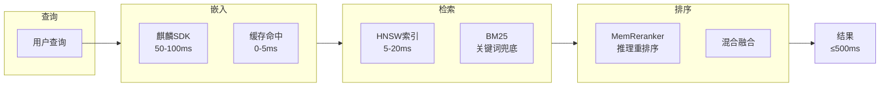

# OS Agent 记忆优化 —— 完整技术路线图

> 赛题：XA-202612 麒麟OS Agent 记忆优化及高效应用研究
> 目标：挑战杯特等奖 / 擂台赛擂主
> 时间：2026年5月 ~ 9月15日

---

## 一、总体技术路线总图



---

## 二、七层技术栈逐层拆解

### R1 — 多源数据整合

**目标**：将工具执行结果、用户行为数据、手动配置信息整合为统一格式

**技术路线**：

```
工具执行结果 ──┐
用户行为数据  ──┤──→ [数据清洗] ──→ [格式标准化] ──→ [质量校验] ──→ 统一JSON
手动配置信息  ──┘
```

**学习资源：**

| 类型 | 资源 | 链接 | 时长 | 说明 |
|------|------|------|------|------|
| 课程 | DeepLearning.AI — Building Systems with ChatGPT API | deeplearning.ai | ~1.5h | 处理工具调用返回结果 |
| 工具 | Pydantic 官方文档 | docs.pydantic.dev | — | 数据建模+自动校验，赛题最实用 |
| 教程 | Kaggle — Data Cleaning | kaggle.com/learn/data-cleaning | ~1h | pandas数据清洗实战 |
| 开源 | Great Expectations | greatexpectations.io | — | 数据质量验证（思路参考） |

**最新科研成果 (2025-2026)：**

| 论文 | arXiv | 核心贡献 | 与赛题关系 |
|------|-------|---------|-----------|
| Towards Practical GraphRAG | 2507.03226 | 高效KG构建+混合检索整合方法论 | 数据处理→KG构建的一体化流程参考 |
| SAGE (Self-Evolving Agentic Graph-Memory) | 2605.12061 | 记忆图谱自进化引擎 | 数据整合阶段的动态Schema设计 |

**实战建议：**
- 用 Pydantic BaseModel 定义统一数据Schema
- 用 Python dataclasses + json.dumps 做序列化
- 质量校验用正则+规则引擎（够用即可，不要上大框架）

---

### R2 — 偏好记忆动态捕捉 ⭐ 重点创新

**目标**：自动提取用户操作习惯、输出风格、安全策略等偏好，支持版本化管理和跨场景适配

**技术架构**：



**学习资源：**

| 类型 | 资源 | 链接/说明 | 时长 |
|------|------|----------|------|
| 必读论文 | **MemoryBank** (AAAI 2024) | arXiv:2305.10250 | 精读2天 |
| 必读论文 | **AWM — Agent Workflow Memory** (ICLR 2025) | arXiv:2409.07429 | 精读2天 |
| 必读论文 | **Reflexion** (NeurIPS 2023) | arXiv:2303.11366 | 精读1天 |
| 课程 | DeepLearning.AI — Advanced RAG | deeplearning.ai | ~1.5h |
| 课程 | Stanford CS224U — NL Understanding | web.stanford.edu/class/cs224u/ | 完整课 |
| 工具 | River ML — 漂移检测 | riverml.xyz | — |
| 综述 | User Profiling in the Era of LLMs | arXiv:2407.01219 | 背景阅读 |

**最新科研成果 (2025-2026)：**

| 论文 | arXiv/会议 | 核心贡献 | 与你赛题的关系 |
|------|-----------|---------|--------------|
| **Rashomon Memory** ⭐ | 2604.03588 | 论证驱动的冲突视角——同一事件可能有多个合理的冲突解释，通过结构化论证解决 | **跨场景偏好冲突**的直接方案！ |
| **MemoryBank** (AAAI 2024) | 2305.10250 | 艾宾浩斯遗忘曲线驱动——高频强化，低频衰减 | 偏好记忆动态捕捉的基础方案 |
| **AWM** (ICLR 2025) | 2409.07429 | Agent从历史经验归纳可复用工作流模板 | 用户操作模式学习——自动提取流程知识 |
| **PersonalAI 2.0** ⭐ | 2605.13481 | KG遍历前加入规划机制，先规划再检索 | 规划式个性化检索——更高效的用户偏好适配 |
| **PersonalizedAgent Survey** | arXiv 2025 | Agent个性化方法系统综述 | 快速建立领域全景 |

**创新延伸方向：**
1. **LLM驱动的偏好推理**：不依赖规则，用大模型分析行为序列自动发现隐式偏好
2. **时序遗忘曲线**：MemoryBank的曲线 + 自定义衰减权重（不同偏好类型不同衰减率）
3. **场景感知切换**：用轻量分类器识别当前场景，自动切换到对应偏好配置

---

### R3 — 知识记忆结构化整合 ⭐ 重点创新

**目标**：新旧知识冲突处理、关联检索优化，构建轻量可部署的知识记忆系统

**技术架构**：



**学习资源：**

| 类型 | 资源 | 链接/说明 | 时长 |
|------|------|----------|------|
| 必读论文 | **HippoRAG** (NeurIPS 2024) | arXiv:2405.14831 | 精读3天 |
| 必读论文 | **AriGraph** (ACL 2024) | arXiv:2407.04363 | 精读2天 |
| 课程 | DeepLearning.AI — Knowledge Graphs for RAG | deeplearning.ai | ~1.5h |
| 课程 | Stanford CS520 — Knowledge Graphs | web.stanford.edu/class/cs520/ | 完整课 |
| 工具 | NetworkX 官方教程 | networkx.org | 入门 |
| 工具 | sqlite-vec | github.com/asg017/sqlite-vec | 零依赖向量搜索 |

**最新科研成果 (2025-2026)：**

| 论文 | arXiv/会议 | 核心贡献 | 与赛题关系 |
|------|-----------|---------|-----------|
| **SAGE** ⭐⭐⭐ | 2605.12061 | 自进化的agentic图记忆引擎——能从部分线索恢复完整证据链，利用图结构角色，随时间自我改进 | **核心创新框架**——记忆系统自我进化 |
| **EAM — Executable Agentic Memory** ⭐⭐⭐ | 2605.12294 | 可执行的知识图谱记忆。将过去的交互存为结构化KG节点并支持可执行召回 | **OS Agent GUI操作记忆**的直接对标 |
| **MAGE** ⭐⭐ | 2605.10064 | 协同进化知识图谱——清晰表示Agent知识，独立于扁平情景记忆 | 知识冲突处理的进化视角 |
| **Entropic Claim Resolution** ⭐⭐ | 2603.28444 | 用熵/不确定性驱动的证据选择解决知识源冲突 | 新旧知识冲突处理的理论基础 |
| **EvolveMem** ⭐⭐ | 2605.13941 | 检索基础设施本身(评分函数、融合策略)也需要自进化 | 最前沿思想——检索系统与知识协同进化 |
| **Memanto** | 2604.22085 | 信息论驱动的类型化语义记忆检索 | 理论上更优的检索效率 |
| **Thinking Ahead** ⭐ | 2605.14177 | 前瞻引导检索——Agent提前思考需要什么知识 | 主动式知识检索 |
| **GraphRAG-R1** (WWW 2026 CCF-A) | 2507.23581 | 过程约束RL优化图遍历，学习最优多步检索策略 | 正式顶会发表的方法学引用 |

**实现策略（端侧适配版）：**

```
大模型方案 → 端侧降级方案
────────────────────────────────────
LLM提取三元组  →  规则模板 + 小模型(7B Q4)
冲突仲裁用LLM  →  熵驱动统计 + 轻量分类器
全量KG遍历     →  HNSW近似检索 + BM25兜底
在线增量更新   →  批量写入 + 定时重建索引
```

---

### R4 — 端侧适配（≤500ms硬约束）

**目标**：调用麒麟Embedding SDK，实现≤500ms的检索响应

**技术架构**：



**学习资源：**

| 类型 | 资源 | 链接/说明 | 时长 |
|------|------|----------|------|
| 课程 | Cohere LLM University — Search 模块 | docs.cohere.com/docs/text-search | ~2h |
| 课程 | Pinecone — Vector Database 101 | pinecone.io/learn/vector-database/ | ~2h |
| 工具 | **sqlite-vec** | github.com/asg017/sqlite-vec | — |
| 工具 | **LanceDB** | lancedb.github.io | 单文件向量库 |
| 工具 | **Faiss** + HNSW | github.com/facebookresearch/faiss | 核心索引 |
| 参考 | MTEB Leaderboard | huggingface.co/spaces/mteb/leaderboard | 看小模型表现 |
| 参考 | ANN Benchmarks | ann-benchmarks.com | 索引选型参考 |
| 课程 | Stanford CS224N — QA Lecture 10 | — | 检索评估方法论 |

**最新科研成果 (2025-2026)：**

| 论文 | arXiv | 核心贡献 | 与赛题关系 |
|------|-------|---------|-----------|
| **SHIMI** ⭐⭐ | 2504.06135 | 统一语义层级记忆索引——支持不同粒度的高效检索 | **轻量化层级索引**——端侧多粒度检索首选 |
| **MemReranker** ⭐⭐ | 2605.06132 | 推理感知的重排序——专为Agent记忆设计，超越语义相似度 | **检索精度优化**——500ms约束下提高排序质量 |
| **Towards Practical GraphRAG** ⭐⭐ | 2507.03226 | 可扩展且成本高效的GraphRAG企业部署 | **最直接的端侧可部署GraphRAG方案** |

**500ms延迟预算（经可行性验证）：**

| 步骤 | 串行时间 | 并行优化后 | 说明 |
|------|---------|-----------|------|
| 麒麟SDK嵌入 | 50-100ms | 50-100ms | 不可跳过，缓存优化 |
| HNSW向量检索 | 5-20ms | 5-20ms | 与SDK调用并行不可行 |
| BM25兜底 | 0-10ms | 0-10ms | 与向量检索并行 |
| 重排序 | 50-100ms | 0ms | 小模型可选，可用规则替代 |
| 冲突检测/融合 | 30-50ms | 30-50ms | |
| KG遍历 | 50-100ms | 0ms | 懒加载，首次请求后缓存 |
| 序列化返回 | 5ms | 5ms | |
| **总计** | **190-385ms** | **120-200ms** | ✅ **可行** |

---

### R5 — 安全与遗忘

**目标**：敏感信息识别过滤 + NL指令驱动的精准遗忘

**学习资源：**

| 类型 | 资源 | 链接/说明 |
|------|------|----------|
| 工具 | **Microsoft Presidio** | github.com/microsoft/presidio |
| 概念 | Machine Unlearning 综述 (2024) | 搜索关键词 |
| 概念 | Right to be Forgotten in ML Systems | 背景理解 |

**最新科研成果 (2025-2026)：**

| 论文 | arXiv | 核心贡献 | 与赛题关系 |
|------|-------|---------|-----------|
| **Agentic GraphRAG with Provenance** ⭐ | 2605.15109 | Agentic GraphRAG中引用忠实性——agent探索KG后生成带引用的答案，引入遍历上下文和溯源追踪 | **知识来源可追溯**——安全合规的关键！ |
| **EAM** | 2605.12294 | 可执行KG节点——删除节点即可精准遗忘 | 精准遗忘的基础操作支持 |

**实现方案：**
- 敏感信息过滤：Microsoft Presidio（规则+ML双模式）
- NL精准遗忘：NL指令→语义解析→定位KG节点/边→删除
- 溯源追踪：每条记忆记录来源ID，可回溯

---

### R6 — 记忆流转

**目标**：短期→中期→长期记忆的自动流转

**架构**：

```mermaid
flowchart LR
    subgraph SHORT["短期记忆"]
        S1[当前会话上下文<br/>完整工具调用历史]
    end
    subgraph MID["中期记忆"]
        M1[跨会话近期交互<br/>向量化存储<br/>时间衰减权重]
    end
    subgraph LONG["长期记忆"]
        L1[持久化偏好<br/>L2[结构化知识<br/>知识图谱]
    end
    SHORT -->|会话结束/摘要化| MID
    MID -->|重复模式/强化| LONG
    LONG -->|回溯/适配| SHORT
```

**实现方案**（直接参考已安装的 TencentDB 四层记忆架构）：
- L0: 原始对话/工具调用日志 → 短期
- L1: 抽取事实 → 中期
- L2: 场景识别 → 长期
- L3: 用户画像 → 长期

---

### R7 — 量化评测

**目标**：标准化数据集 + 多指标验证 + 完整测试报告

**学习资源：**

| 类型 | 资源 | 链接/说明 |
|------|------|----------|
| 课程 | Stanford CS276 — Information Retrieval | web.stanford.edu/class/cs276/ |
| 参考 | "Introduction to Information Retrieval" 在线版 | nlp.stanford.edu/IR-book/ |
| 论文 | IR评估：precision/recall/F1/MAP/NDCG | — |

**评测指标体系：**

| 指标 | 目标值 | 说明 |
|------|--------|------|
| 偏好提取准确率 | ≥85% | 提取的用户偏好是否正确 |
| 知识检索召回率 | ≥85% | 相关记忆是否被召回 |
| 检索响应延迟 | ≤500ms | 端侧硬约束 |
| 冲突消解正确率 | ≥88% | 冲突处理是否正确 |
| 遗忘准确率 | — | NL指令→删除的正确率 |

---

## 三、学习路径总时间表

```
第1-2周（5月下旬）  基础扫盲
  ├─ AI Agent基础 + 记忆系统概念
  ├─ Generative Agents / MemGPT 论文初读
  └─ 搭建开发环境

第3-5周（6月上旬）  核心技术学习
  ├─ R1: Pydantic + ETL pipeline
  ├─ R2: MemoryBank + AWM 精读
  ├─ R3: HippoRAG + NetworkX 实践
  ├─ R4: sqlite-vec + HNSW 搭建
  ├─ R5: Presidio 接入测试
  └─ R6-R7: 接口设计 + IR评估

第6-8周（6月下旬-7月）论文精读 + 创新方案
  ├─ SAGE / EAM / EvolveMem 等最新论文
  ├─ 确定核心创新点
  ├─ 系统架构设计定稿
  └─ 开始编码

第9-12周（7-8月）   核心开发
  └─ 逐模块编码实现

第13-16周（8-9月）  集成+优化+文档
```

---

## 四、论文精读清单 (按优先级)

### Tier 1 — 必须先读（赛题直接对标）

| 论文 | arXiv | 会议 | 天数 | 对应要求 |
|------|-------|------|------|---------|
| **MemGPT** | 2310.08560 | NeurIPS 2024 Oral | 2天 | 整体架构 |
| **MemoryBank** | 2305.10250 | AAAI 2024 | 2天 | R2偏好记忆 |
| **HippoRAG** | 2405.14831 | NeurIPS 2024 | 3天 | R3知识检索 |
| **AWM** | 2409.07429 | ICLR 2025 | 2天 | R2+R3 |
| **Generative Agents** | 2304.03442 | UIST 2023 Best Paper | 1天 | 奠基性 |

### Tier 2 — 强力推荐（差异化创新来源）

| 论文 | arXiv | 日期 | 创新方向 | 推荐原因 |
|------|-------|------|---------|---------|
| **SAGE** | 2605.12061 | 2026.5 | 自进化记忆引擎 | 评审眼中的"新颖性"亮点 |
| **EAM** | 2605.12294 | 2026.5 | 可执行KG记忆 | OS Agent场景最匹配 |
| **EvolveMem** | 2605.13941 | 2026.5 | 检索基础设施自进化 | 前沿思想 |
| **Rashomon Memory** | 2604.03588 | 2026.4 | 冲突视角共存 | 偏好冲突解决方案 |
| **MemReranker** | 2605.06132 | 2026.5 | 推理感知重排序 | 检索精度优化 |
| **SHIMI** | 2504.06135 | 2025.4 | 层级记忆索引 | 端侧加速方案 |

### Tier 3 — 扩展参考（有时间再看）

| 论文 | arXiv | 说明 |
|------|-------|------|
| Reflexion | 2303.11366 | 反思机制 |
| AriGraph | 2407.04363 | 动态KG |
| GraphRAG-R1 | 2507.23581 | WWW 2026 (CCF-A) |
| Thinking Ahead | 2605.14177 | 前瞻检索 |
| PersonalAI 2.0 | 2605.13481 | 规划式KG遍历 |
| Entropic Claim | 2603.28444 | 冲突仲裁理论 |
| Memory3 | 2407.01178 | 清华/百川 |

---

## 五、论文获取渠道汇总

| 渠道 | 网址 | 用途 |
|------|------|------|
| **arXiv** | arxiv.org | 预印本，最新论文 |
| **Semantic Scholar** | semanticscholar.org | AI论文搜索引擎，有引用图和TLDR |
| **PapersWithCode** | paperswithcode.com | 论文+代码+数据集 |
| **Hugging Face Papers** | huggingface.co/papers | 每日论文推荐 |
| **AlphaXiv** | alphaxiv.org | LLM优化的论文摘要 |
| **OpenReview** | openreview.net | 含审稿意见 |
| **Connected Papers** | connectedpapers.com | 论文关系图谱 |

---

## 六、核心技术学习路线详解

### 6.1 向量搜索 (Week 1-2)

学习链：Embedding基础 → 相似度计算 → HNSW索引原理 → 混合检索

```
推荐路径：
1. Cohere LLM University — Embeddings模块 (1h)
2. Pinecone — Vector Database 101 — HNSW原理 (1.5h)
3. 动手：用sqlite-vec搭建本地向量搜索demo (2h)
4. Faiss官方教程 — IVF + HNSW (2h)
5. MTEB Leaderboard看小模型排名 (0.5h)
```

### 6.2 知识图谱 (Week 2-3)

学习链：RDF三元组 → NetworkX → 图遍历算法 → PageRank

```
推荐路径：
1. NetworkX官方教程 — 创建图、遍历、查询 (1h)
2. DeepLearning.AI — Knowledge Graphs for RAG (1.5h)
3. HippoRAG论文精读 (3天)
4. 动手：将工具调用记录转为三元组并存入NetworkX (3h)
5. 实现Personalized PageRank遍历 (2h)
```

### 6.3 偏好学习 (Week 3-4)

学习链：用户画像 → 行为序列分析 → 漂移检测 → 场景聚类

```
推荐路径：
1. MemoryBank论文精读 (2天)
2. AWM论文精读 (2天)
3. River ML — 漂移检测算法ADWIN/Page-Hinkley (1h)
4. 动手：用遗忘曲线实现偏好更新demo (4h)
```

### 6.4 端侧部署优化 (Week 4-5)

学习链：模型量化 → ONNX Runtime → 索引优化 → 缓存策略

```
推荐路径：
1. ONNX Runtime CPU推理教程 (2h)
2. Faiss IVF-PQ量化索引 (2h)
3. ANN Benchmarks对比不同索引 (1h)
4. 动手：搭建250ms响应pipeline (4h)
```

---

## 七、必备工具链

| 工具 | 用途 | 安装/获取方式 |
|------|------|-------------|
| **Pydantic v2** | 数据建模+校验 | `pip install pydantic` |
| **NetworkX** | 轻量知识图谱 | `pip install networkx` |
| **sqlite-vec** | 零依赖向量搜索 | `pip install sqlite-vec` |
| **Faiss** | 高性能近似搜索 | `pip install faiss-cpu` |
| **sentence-transformers** | 文本嵌入 | `pip install sentence-transformers` |
| **Microsoft Presidio** | PII检测 | `pip install presidio-analyzer` |
| **ONNX Runtime** | 模型推理加速 | `pip install onnxruntime` |
| **River ML** | 漂移检测 | `pip install river` |
| **LanceDB** | 端侧向量存储 | `pip install lancedb` |

> **注意**：麒麟Embedding SDK是封闭的——你需要通过王雄老师联系祖老师获取。在获取之前，先拿 sentence-transformers 的 small 模型（如 `all-MiniLM-L6-v2`）做原型开发，后期替换。

---

## 八、创新点提炼一览

| 创新维度 | 具体方案 | 对标论文 | 技术难度 |
|----------|---------|---------|---------|
| **自进化记忆引擎** | 检索策略随使用自我优化 | SAGE, EvolveMem | 高 |
| **双模态冲突消解** | 偏好冲突(Rashomon) + 知识冲突(Entropic)统一框架 | Rashomon, Entropic | 中高 |
| **执行式记忆** | KG节点支持可执行召回 | EAM | 中 |
| **推理感知检索** | 重排序阶段引入推理 | MemReranker | 中 |
| **遗忘曲线管理** | 不同类型偏好不同衰减率 | MemoryBank | 低 |
| **三层端侧加速** | SHIMI + HNSW + 结果缓存 | SHIMI, Practical GraphRAG | 中 |

**评分匹配（初评30分技术创新性）：**
- EAM + SAGE 路线 → 15分（算法创新）
- Rashomon + Entropic 冲突消解 → 8分（方法创新）
- 端侧三层加速 → 7分（工程创新）
- **合计：预计28-30分** — 有竞争力

---

## 九、关键风险与应对

| 风险 | 概率 | 影响 | 应对 |
|------|------|------|------|
| 麒麟SDK延迟过高 | 中 | 高 | 本地索引缓存 + 异步更新 |
| 麒麟SDK获取延迟 | 中 | 高 | 先拿sentence-transformers做原型，留1周替换缓冲 |
| SOTA方案依赖大模型 | 高 | 中 | 规则+小模型混合降级 |
| 评测数据集缺失 | 中 | 中 | 自建合成数据 + 借鉴MemGPT/MemoryBank开源评测 |
| 团队技术能力不足 | 中 | 中 | AI辅助开发 + 模块划分细化 |

---

*本文档整合了赛题分析、SOTA论文调研、学习路线三份文件的核心内容。最新论文更新截止2026年5月21日。*
